## Nama: Muhammad Adiansyah
## NPM: 2306244980
## Tutorial 2

# Kafka
1. Berikan tangkapan layar ketika Kafka server berhasil dijalankan dan topic berhasil dibuat. Jelaskan bagaimana cara memverifikasi bahwa topic tersebut benar-benar sudah terdaftar di Kafka.

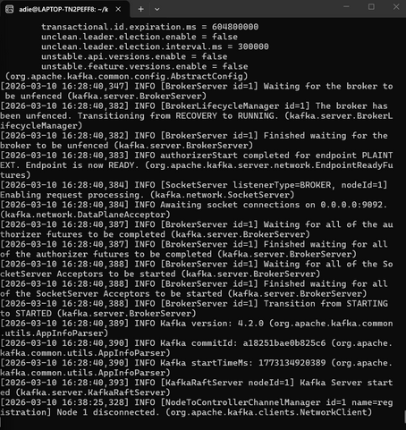
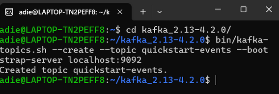

- Cara pertama untuk memverifikasinya adalah dengan melihat output konfirmasi Created topic quickstart-events. pada terminal saat perintah dijalankan. Cara kedua yang lebih pasti adalah dengan meminta Kafka menampilkan daftar seluruh topic yang ada di dalam server-nya menggunakan perintah bawaan Kafka, yaitu: bin/kafka-topics.sh --list --bootstrap-server localhost:9092. Jika nama topic quickstart-events muncul pada layar terminal, itu membuktikan bahwa topic tersebut sudah benar-benar terdaftar dan disimpan di dalam Kafka broker

2. Berikan tangkapan layar ketika producer mengirim beberapa event ke topic dan consumer membaca event tersebut. Apa yang terjadi pada consumer jika producer terus mengirim data dalam jumlah besar secara terus-menerus?

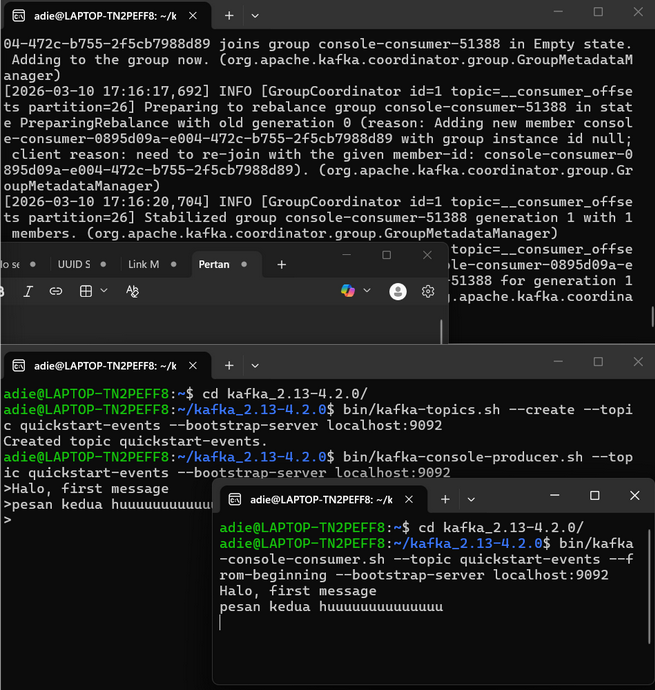

- Jika producer terus mengirim data dalam jumlah besar, consumer tidak akan kewalahan atau kehilangan data. Hal ini karena pesan yang dikirim oleh producer akan disimpan oleh Kafka ke dalam log storage berbasis disk, sehingga tidak langsung dihapus. Consumer kemudian dapat membaca pesan dari partition tersebut secara independen , mengambil pesan secara berkala sesuai dengan kemampuannya sendiri tanpa terpengaruh oleh seberapa cepat producer mengirimkan data.

3. Jalankan dua consumer secara bersamaan untuk membaca topic yang sama. Berikan tangkapan layar dan jelaskan bagaimana pesan didistribusikan kepada masing-masing consumer.

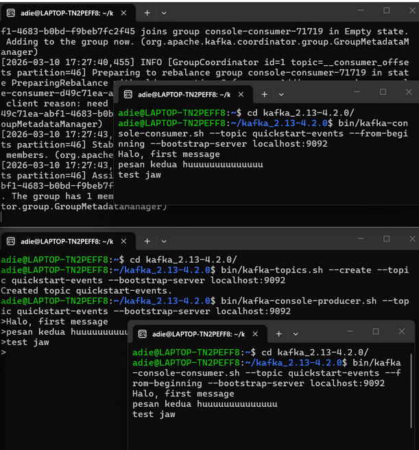

- Pesan didistribusikan kepada masing-masing consumer secara utuh (di-broadcast). Karena Kafka tidak langsung menghapus pesan setelah dibaca, hal ini memungkinkan beberapa consumer untuk membaca data yang sama secara independen. Apabila kita ingin membagi beban kerja agar pesan tidak dibaca ganda, consumer tersebut harus digabungkan ke dalam satu consumer group.

4. Hentikan Kafka server secara paksa ketika producer sedang berjalan. Jelaskan apa yang terjadi pada producer dan consumer serta bagaimana Kafka menangani kondisi tersebut ketika server dijalankan kembali.

- ketika Kafka broker (server) dihentikan secara paksa, koneksi akan terputus karena broker bertugas melayani permintaan dari producer maupun consumer. Producer akan mengalami error karena tidak bisa mengirim pesan, dan consumer akan berhenti menerima aliran data. Namun, saat server dijalankan kembali, Kafka menanganinya dengan memulihkan data yang telah disimpan secara persisten di dalam log storage berbasis disk. Hal ini memastikan tidak ada data historis yang hilang, sehingga sistem dapat kembali berjalan normal.

# RabbitMQ
5. Berikan tangkapan layar ketika RabbitMQ Management Dashboard berhasil diakses melalui browser. Jelaskan informasi apa saja yang dapat dipantau melalui dashboard tersebut.

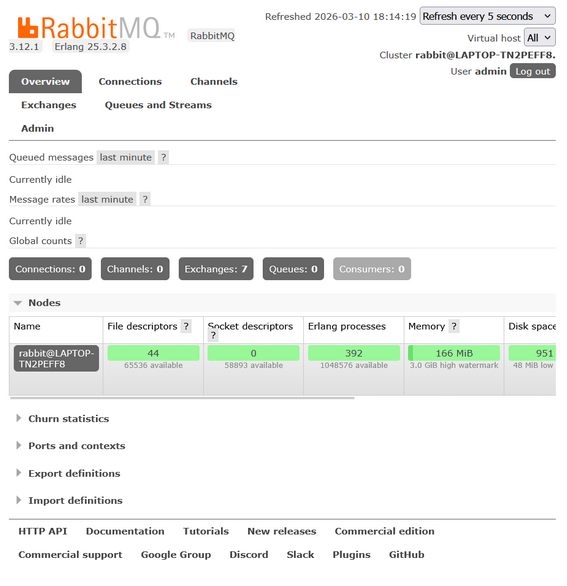

- Melalui RabbitMQ Management Dashboard, kita dapat memantau secara langsung (real-time) berbagai komponen inti dari sistem messaging. Informasi yang dapat dipantau meliputi jumlah antrean pesan yang siap (Ready), belum dikonfirmasi (Unacked), dan total pesan (Total) pada grafik Queued messages. Selain itu, kita juga bisa melihat metrik kecepatan masuk dan keluarnya pesan (Message rates), serta jumlah total Connections, Channels, Exchanges, Queues, dan Consumers yang sedang aktif dalam node RabbitMQ tersebut.

6. Jalankan script publish.py beberapa kali untuk mengirim banyak pesan ke queue. Berikan tangkapan layar dari dashboard RabbitMQ dan jelaskan bagaimana jumlah pesan dalam queue berubah.

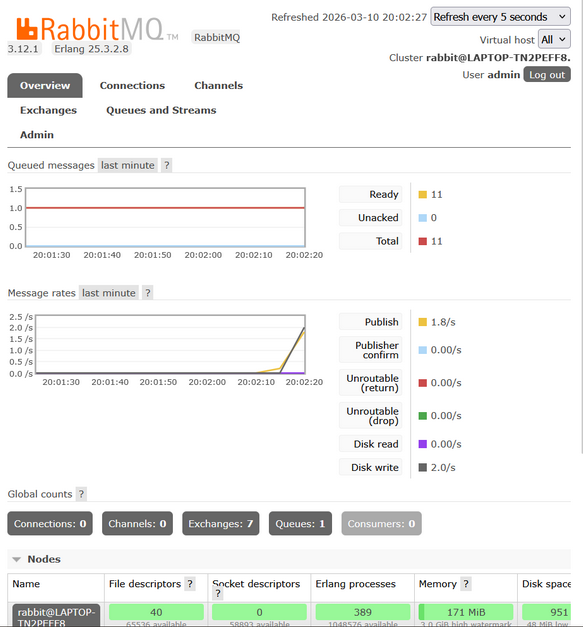

- Saat script publish.py dijalankan beberapa kali tanpa adanya consumer yang aktif, pesan-pesan tersebut dikirim oleh producer ke exchange dan diteruskan untuk disimpan sementara di dalam queue bernama hello . Pada dashboard RabbitMQ, kita dapat melihat jumlah pesan dalam antrean berubah: grafik Queued messages mengalami lonjakan, dan angka pada metrik Ready bertambah sesuai dengan jumlah pesan yang dikirimkan. Pesan tersebut berstatus Ready karena sedang aman mengantre di dalam queue dan menunggu hingga ada consumer yang mengambil dan memprosesnya.

7. Jalankan lebih dari satu consumer secara bersamaan untuk membaca queue yang sama. Berikan tangkapan layar dan jelaskan bagaimana RabbitMQ mendistribusikan pesan kepada consumer tersebut.

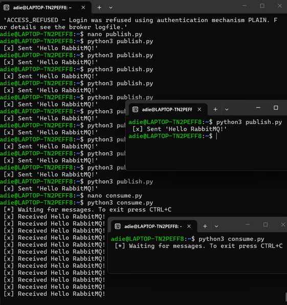

- RabbitMQ mendistribusikan pesan dari satu queue kepada beberapa consumer menggunakan metode Round-Robin. Saat lebih dari satu consumer mendengarkan queue yang sama, RabbitMQ akan mengirimkan pesan secara bergiliran secara berurutan ke setiap consumer yang aktif. Misalnya, pesan pertama dikirim ke consumer A, pesan kedua dikirim ke consumer B, dan seterusnya secara merata . Mekanisme ini sangat berguna untuk melakukan load balancing (pembagian beban kerja) agar tidak ada consumer yang kewalahan.

8. Hentikan consumer secara tiba-tiba saat masih terdapat pesan di queue. Jelaskan apa yang terjadi pada pesan yang belum diproses dan bagaimana RabbitMQ menangani kondisi tersebut.

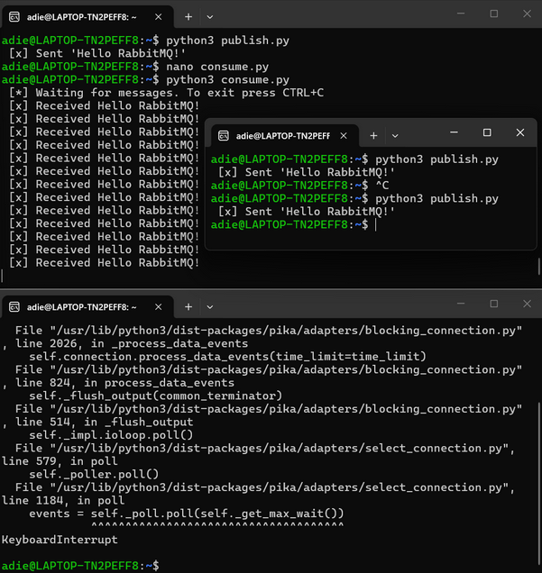

- Dalam arsitektur RabbitMQ, pesan yang sudah berada di queue akan menunggu hingga consumer mengambil dan memprosesnya. Secara default, RabbitMQ membutuhkan acknowledgment (tanda terima) dari consumer sebagai konfirmasi bahwa pesan telah berhasil diproses dengan benar. Jika sebuah consumer dihentikan secara tiba-tiba (misal putus koneksi atau crash) sebelum mengirimkan acknowledgment untuk pesan yang sedang dipegangnya, RabbitMQ akan menyadari bahwa pesan tersebut tidak selesai diproses. Sebagai penanganannya, RabbitMQ akan otomatis mengembalikan pesan tersebut ke dalam antrean (Requeue) dan mengirimkannya ulang kepada consumer lain yang sedang aktif untuk memastikan tidak ada pesan yang hilang.

# Master-Slave Database
9. Berikan tangkapan layar ketika master dan slave database berhasil dijalankan pada port yang berbeda. Jelaskan bagaimana cara memastikan kedua server database tersebut berjalan secara be

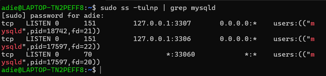

- Untuk memastikan kedua server database berjalan secara bersamaan di dalam satu mesin, kita harus mengonfigurasinya agar menggunakan port dan socket yang berbeda (Master di port 3306, Slave di port 3307). Cara memastikannya adalah dengan mengecek port jaringan yang sedang aktif mendengarkan koneksi menggunakan perintah sistem (seperti ss -tulnp atau netstat), yang akan menampilkan dua proses mysqld terpisah yang berjalan berdampingan pada port 3306 dan 3307. Selain itu, kita juga bisa memastikannya dengan mencoba login ke kedua database tersebut melalui socket masing-masing secara bersamaan.

10. Setelah replication berhasil dijalankan, lakukan beberapa operasi INSERT pada master database. Berikan tangkapan layar yang menunjukkan bahwa perubahan data tersebut juga muncul pada slave database.

- Slave_IO_Running (Yes): Menandakan bahwa IO Thread pada server Slave sedang aktif dan berhasil terhubung ke server Master. Thread ini bertugas untuk membaca binary log (catatan perubahan) dari Master dan menyalinnya ke relay log di mesin Slave secara real-time.

- Slave_SQL_Running (Yes): Menandakan bahwa SQL Thread pada server Slave sedang aktif. Thread ini bertugas untuk membaca data dari relay log yang sudah disalin tadi, lalu mengeksekusi instruksi SQL-nya ke dalam database Slave agar isinya benar-benar sama persis dengan Master. Jika keduanya Yes, berarti proses replikasi berjalan dengan sempurna.

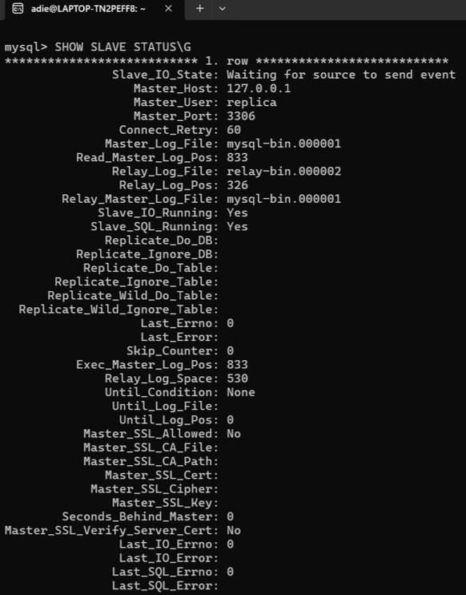

11. Hentikan server master secara paksa setelah replication berjalan. Jelaskan apa yang terjadi pada slave database dan apakah data yang telah direplikasi masih dapat diakses.

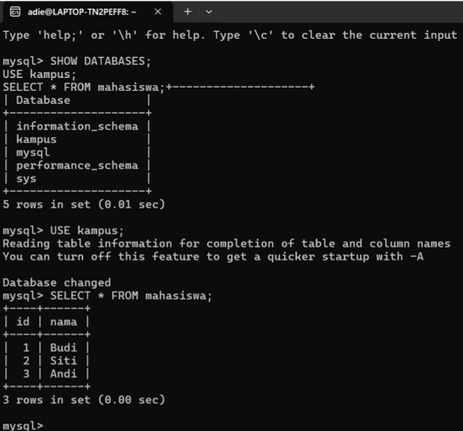

- Mekanisme aliran replikasi terjadi secara asynchronous dan otomatis. Saat kita membuat database, tabel, dan memasukkan data (seperti nama mahasiswa) di server Master, Master akan mencatat semua perubahan tersebut ke dalam sebuah file khusus yang disebut Binary Log (binlog). Di sisi lain, IO Thread milik server Slave yang terus memantau Master akan mendeteksi adanya catatan baru di binlog. Slave kemudian menyalin catatan instruksi tersebut ke dalam komputernya sendiri, menyimpannya di Relay Log. Terakhir, SQL Thread milik Slave membaca isi Relay Log tersebut dan mengeksekusi ulang instruksi SQL-nya (seperti CREATE dan INSERT), sehingga isi database Slave menjadi sama persis (replika) dengan Master.

12. Lakukan perubahan data secara langsung pada slave database. Berikan tangkapan layar dan jelaskan apakah perubahan tersebut akan tersinkronisasi kembali ke master atau tidak.

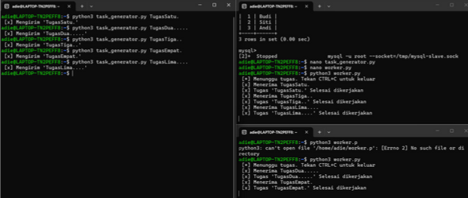

Pada tugas ini, saya mengimplementasikan sistem event-driven berupa Task Queue menggunakan RabbitMQ yang terdiri dari Producer (task_generator.py) dan beberapa Consumer (worker.py). Desain ini mengandalkan tiga mekanisme utama. Pertama, pemisahan beban (decoupling), sehingga Producer dapat mengirim tugas ke antrean tanpa harus menunggu proses selesai (tidak blocking). Kedua, durabilitas tinggi (Message Durability), menggunakan durable=True dan PERSISTENT_DELIVERY_MODE agar pesan tugas tersimpan aman di disk dan tidak hilang saat server mati tiba-tiba. Ketiga, pembagian kerja yang adil (Fair Dispatch) menggunakan channel.basic_qos(prefetch_count=1). Melalui pengaturan ini, RabbitMQ hanya akan memberikan tugas baru kepada worker yang sedang menganggur dan telah menyelesaikan tugas sebelumnya. Hal ini sangat efektif untuk melakukan load balancing dan mencegah penumpukan antrean beban kerja pada satu pekerja saja.
